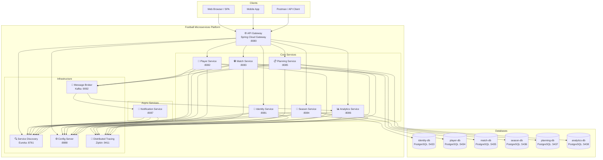
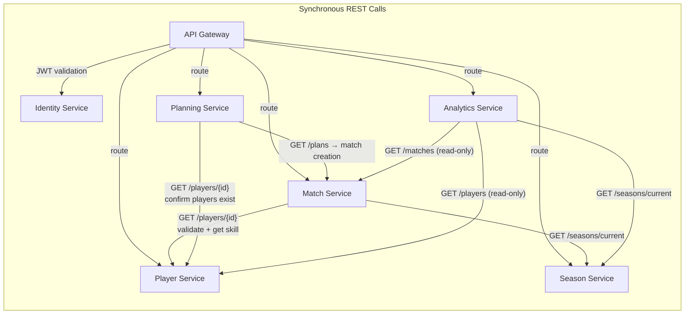
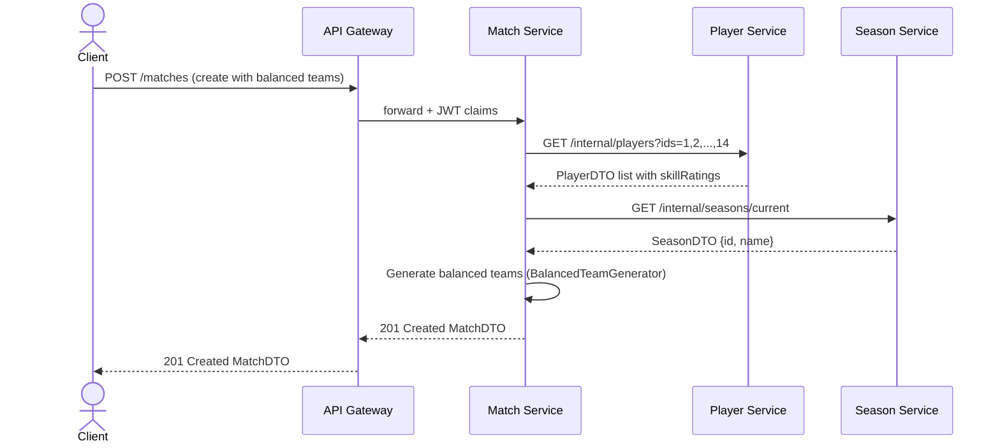
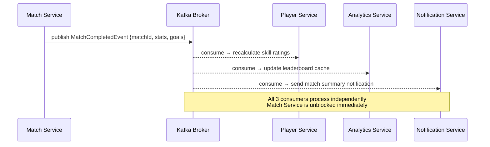
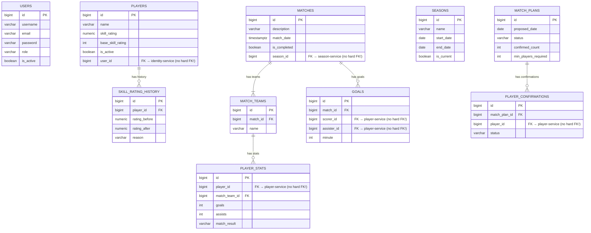
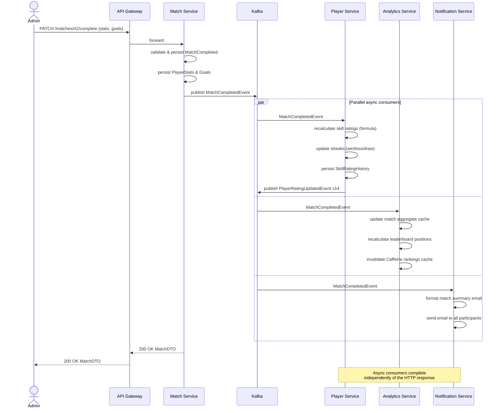
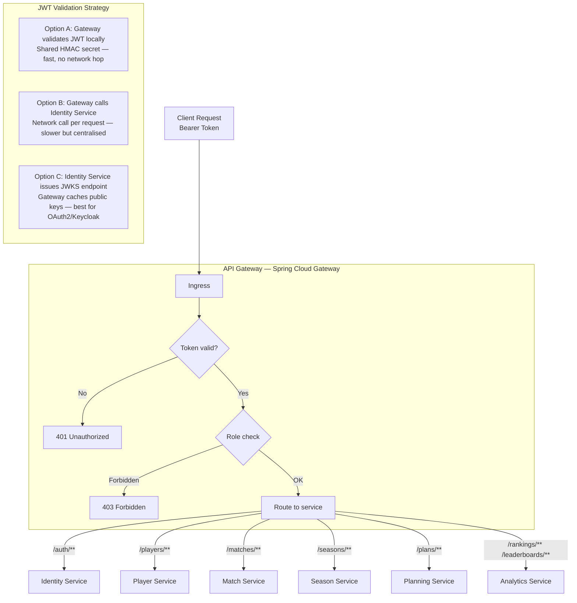
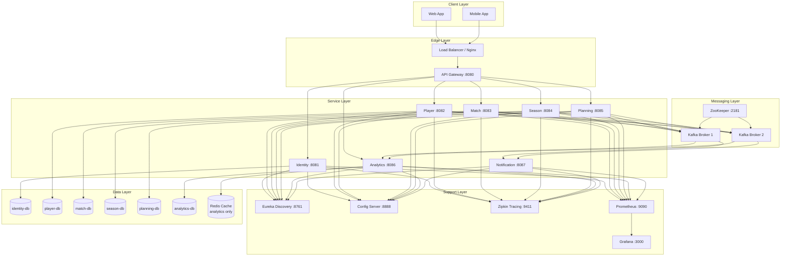
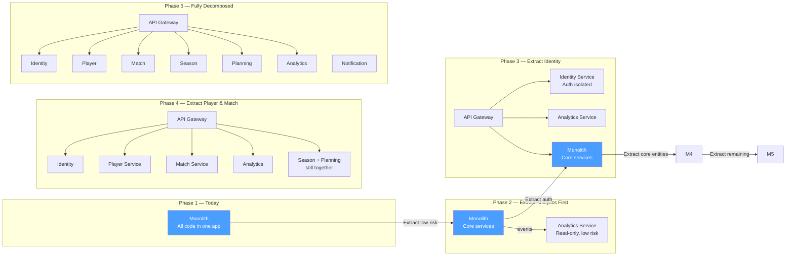

# Football Management System — Microservices Architecture
> **Purpose:** Educational reference — how this monolith could be decomposed into microservices.
> **Current State:** Single Spring Boot monolith (correct for this project scale)
> **Last Updated:** 2026-05-16

---

## Table of Contents

1. [Overview](#1-overview)
2. [Current Monolith Structure](#2-current-monolith-structure)
3. [Proposed Service Decomposition](#3-proposed-service-decomposition)
4. [System Context Diagram](#4-system-context-diagram)
5. [Service Map Diagram](#5-service-map-diagram)
6. [Communication Patterns](#6-communication-patterns)
7. [Data Architecture — Database per Service](#7-data-architecture--database-per-service)
8. [Event-Driven Flow: Match Completion](#8-event-driven-flow-match-completion)
9. [API Gateway & Security Flow](#9-api-gateway--security-flow)
10. [Infrastructure Topology](#10-infrastructure-topology)
11. [Service Contracts Summary](#11-service-contracts-summary)
12. [Migration Path: Monolith → Microservices](#12-migration-path-monolith--microservices)
13. [Trade-offs & When NOT to Use Microservices](#13-trade-offs--when-not-to-use-microservices)

---

## 1. Overview

The Football Management System is currently a **well-structured monolith** — the right
architectural choice for its scale. However, decomposing it into microservices is an
excellent exercise to understand:

- Domain-driven design (DDD) and bounded contexts
- Synchronous (REST/gRPC) vs asynchronous (event-driven) communication
- Database-per-service pattern and data consistency challenges
- API Gateway, service discovery, and distributed tracing
- The real costs of microservices at small scale

### Bounded Contexts (DDD)

Before splitting into services, the domain must be divided into **bounded contexts** —
cohesive areas with clear ownership and minimal coupling:

```
┌─────────────────────────────────────────────────────────────────────┐
│                    Football Management Domain                         │
│                                                                       │
│  ┌───────────────┐  ┌───────────────┐  ┌──────────────────────────┐ │
│  │   Identity    │  │    Player     │  │         Match            │ │
│  │   Context     │  │   Context     │  │         Context          │ │
│  │               │  │               │  │                          │ │
│  │  Users        │  │  Players      │  │  Matches                 │ │
│  │  Auth/JWT     │  │  SkillRatings │  │  Teams                   │ │
│  │  Roles        │  │  Streaks      │  │  Goals                   │ │
│  └───────────────┘  └───────────────┘  │  PlayerStats             │ │
│                                         └──────────────────────────┘ │
│  ┌───────────────┐  ┌───────────────┐  ┌──────────────────────────┐ │
│  │   Season      │  │  Planning     │  │      Analytics           │ │
│  │   Context     │  │   Context     │  │      Context             │ │
│  │               │  │               │  │                          │ │
│  │  Seasons      │  │  MatchPlans   │  │  Leaderboards            │ │
│  │  Transitions  │  │  Confirmations│  │  Rankings                │ │
│  │  Rating Reset │  │  Scheduling   │  │  Aggregates              │ │
│  └───────────────┘  └───────────────┘  └──────────────────────────┘ │
└─────────────────────────────────────────────────────────────────────┘
```

---

## 2. Current Monolith Structure

The current application packages map directly to what would become separate services:

```
football-monolith/
├── service/
│   ├── AuthService.java          → identity-service
│   ├── UserService.java          → identity-service
│   ├── UserDetailsServiceImpl    → identity-service
│   ├── PlayerService.java        → player-service
│   ├── MatchService.java         → match-service
│   └── MatchEventListener.java   → notification-service (async)
├── controller/
│   ├── AuthController.java
│   ├── UserController.java
│   ├── PlayerController.java
│   └── MatchController.java
└── model/
    ├── AppUser.java              → identity-service DB
    ├── Player.java               → player-service DB
    ├── Match.java                → match-service DB
    ├── MatchTeam.java            → match-service DB
    ├── PlayerStats.java          → match-service DB (or analytics)
    ├── Goal.java                 → match-service DB
    ├── SkillRatingHistory.java   → player-service DB
    ├── Season.java               → season-service DB
    ├── MatchPlan.java            → planning-service DB
    └── PlayerConfirmation.java   → planning-service DB
```

---

## 3. Proposed Service Decomposition

| # | Service | Owns | Exposes | Tech Stack |
|---|---------|------|---------|------------|
| 1 | **identity-service** | `users`, JWT issuance, roles | `POST /auth/**`, `GET/POST/PATCH /users/**` | Spring Boot, PostgreSQL |
| 2 | **player-service** | `players`, `skill_rating_history` | `GET/POST/PATCH/DELETE /players/**` | Spring Boot, PostgreSQL |
| 3 | **match-service** | `matches`, `match_teams`, `player_stats`, `goals` | `GET/POST/PATCH /matches/**` | Spring Boot, PostgreSQL |
| 4 | **season-service** | `seasons`, rating transition logic | `GET/POST/PATCH /seasons/**` | Spring Boot, PostgreSQL |
| 5 | **planning-service** | `match_plans`, `player_confirmations` | `GET/POST/PATCH /plans/**` | Spring Boot, PostgreSQL |
| 6 | **analytics-service** | Materialised views, rankings, leaderboards | `GET /rankings/**`, `GET /leaderboards/**` | Spring Boot, Read-only replica / Redis |
| 7 | **notification-service** | Email/push notifications, match alerts | Subscribes to events only | Spring Boot, Kafka consumer |
| 8 | **api-gateway** | Routing, auth validation, rate limiting | All public endpoints | Spring Cloud Gateway |

---

## 4. System Context Diagram



---

## 5. Service Map Diagram

This diagram shows which services call which others (synchronous REST only):



### Key Design Decision: Who knows about whom?

| Caller | Callee | Why synchronous? |
|--------|--------|-----------------|
| `match-service` | `player-service` | Team generation needs live skill ratings |
| `match-service` | `season-service` | Match must be linked to current season |
| `planning-service` | `player-service` | Must verify players exist before RSVP |
| `analytics-service` | `player-service` + `match-service` | Aggregates data across domains |
| `api-gateway` | `identity-service` | JWT validation on every request |

---

## 6. Communication Patterns

### 6a. Synchronous (REST)

Used when the **caller needs an immediate response** to continue processing:



### 6b. Asynchronous (Events via Kafka)

Used when the **caller does not need the result** and wants to avoid coupling:



### 6c. Event Catalogue

| Event | Producer | Consumers | Payload |
|-------|----------|-----------|---------|
| `MatchCreatedEvent` | match-service | planning-service, analytics-service | matchId, seasonId, teamIds |
| `MatchCompletedEvent` | match-service | player-service, analytics-service, notification-service | matchId, playerStats[], goals[] |
| `PlayerRatingUpdatedEvent` | player-service | analytics-service | playerId, oldRating, newRating |
| `SeasonEndedEvent` | season-service | player-service, analytics-service | seasonId, allPlayerRatings[] |
| `PlanConfirmedEvent` | planning-service | match-service, notification-service | planId, confirmedPlayerIds[] |
| `PlayerCreatedEvent` | player-service | analytics-service | playerId, name, baseSkillRating |

---

## 7. Data Architecture — Database per Service

Each service owns its data exclusively. **No shared tables, no cross-service JOINs.**



> ⚠️ **Important:** Cross-service references (e.g., `player_id` in `player_stats`) are stored
> as plain `BIGINT` columns — **not enforced foreign keys**. Referential integrity is maintained
> at the application layer via service calls and eventual consistency.

---

## 8. Event-Driven Flow: Match Completion

The most complex flow in the system — when a match is finalised:



---

## 9. API Gateway & Security Flow

The API Gateway is the **single entry point**. It handles:
- JWT validation (delegates to identity-service or validates locally)
- Rate limiting
- Request routing
- Response caching headers



### Route Table

| Client Path | Routed To | Auth Required | Roles |
|-------------|-----------|---------------|-------|
| `POST /auth/login` | identity-service | ❌ None | — |
| `POST /auth/register` | identity-service | ❌ None | — |
| `GET /players/**` | player-service | ✅ Any authenticated | — |
| `POST /players` | player-service | ✅ GROUP_ADMIN or MASTER | — |
| `DELETE /players/{id}` | player-service | ✅ GROUP_ADMIN only | — |
| `GET /matches/**` | match-service | ✅ Any authenticated | — |
| `POST /matches` | match-service | ✅ GROUP_ADMIN or MASTER | — |
| `GET /rankings/**` | analytics-service | ✅ Any authenticated | — |
| `GET /leaderboards/**` | analytics-service | ✅ Any authenticated | — |
| `GET /seasons/**` | season-service | ✅ Any authenticated | — |
| `GET /plans/**` | planning-service | ✅ Any authenticated | — |

---

## 10. Infrastructure Topology



### Docker Compose (simplified)

```yaml
# How this would look in docker-compose.yml for local dev
services:
  # Infrastructure
  eureka:        image: eureka-server:latest    ports: ["8761:8761"]
  config-server: image: config-server:latest    ports: ["8888:8888"]
  kafka:         image: confluentinc/cp-kafka   ports: ["9092:9092"]
  zipkin:        image: openzipkin/zipkin        ports: ["9411:9411"]

  # Databases (one per service)
  identity-db:  image: postgres:16   environment: {POSTGRES_DB: identity_db}
  player-db:    image: postgres:16   environment: {POSTGRES_DB: player_db}
  match-db:     image: postgres:16   environment: {POSTGRES_DB: match_db}
  season-db:    image: postgres:16   environment: {POSTGRES_DB: season_db}
  planning-db:  image: postgres:16   environment: {POSTGRES_DB: planning_db}
  analytics-db: image: postgres:16   environment: {POSTGRES_DB: analytics_db}

  # Services
  api-gateway:          ports: ["8080:8080"]   depends_on: [eureka, config-server]
  identity-service:     ports: ["8081:8081"]   depends_on: [identity-db, eureka]
  player-service:       ports: ["8082:8082"]   depends_on: [player-db, eureka]
  match-service:        ports: ["8083:8083"]   depends_on: [match-db, eureka, kafka]
  season-service:       ports: ["8084:8084"]   depends_on: [season-db, eureka]
  planning-service:     ports: ["8085:8085"]   depends_on: [planning-db, eureka]
  analytics-service:    ports: ["8086:8086"]   depends_on: [analytics-db, eureka, kafka]
  notification-service: ports: ["8087:8087"]   depends_on: [eureka, kafka]
```

---

## 11. Service Contracts Summary

Each service exposes an **internal API** (service-to-service) and a **public API** (via gateway).

### Identity Service
```
Public:   POST   /auth/login          → JwtResponse
          POST   /auth/register       → UserDTO
          GET    /users               → Page<UserDTO>
          PATCH  /users/{id}          → UserDTO

Internal: GET    /internal/users/{id} → UserDTO (used by player-service)
          POST   /internal/token/validate → TokenValidationResult (used by gateway)
```

### Player Service
```
Public:   GET    /players             → Page<PlayerDTO>
          GET    /players/{id}        → PlayerDTO
          POST   /players             → PlayerDTO
          PATCH  /players/{id}        → PlayerDTO
          DELETE /players/{id}        → 204

Internal: GET    /internal/players?ids=1,2,3 → List<PlayerInternalDTO>
          POST   /internal/players/{id}/rating → void (called after rating update)
```

### Match Service
```
Public:   GET    /matches             → Page<MatchDTO>
          GET    /matches/{id}        → MatchDTO
          POST   /matches             → MatchDTO
          PATCH  /matches/{id}/complete → MatchDTO
          DELETE /matches/{id}        → 204

Internal: GET    /internal/matches/{id}/stats → MatchStatsDTO
```

### Analytics Service
```
Public:   GET    /rankings            → Page<RankingDTO>    (cached)
          GET    /leaderboards        → LeaderboardDTO      (cached)
          GET    /rankings/players/{id} → PlayerRankingDTO

Internal: POST   /internal/refresh    → void (triggered by events)
```

---

## 12. Migration Path: Monolith → Microservices

If you were to incrementally migrate this monolith, the **Strangler Fig Pattern** is ideal:



### Migration Checklist

- [ ] **Step 1:** Add `MatchEventListener` (already exists!) → expand to publish to Kafka topic
- [ ] **Step 2:** Extract `AnalyticsService` as a standalone app — it's read-only, safest to move first
- [ ] **Step 3:** Add API Gateway (Spring Cloud Gateway) in front of the monolith
- [ ] **Step 4:** Extract `AuthService` + `UserService` → `identity-service` with its own DB
- [ ] **Step 5:** Extract `PlayerService` → `player-service` — migrate `players` table
- [ ] **Step 6:** Extract `MatchService` → `match-service` — migrate `matches`, `match_teams`, `player_stats`, `goals`
- [ ] **Step 7:** Extract `SeasonService` → `season-service`
- [ ] **Step 8:** Extract planning logic → `planning-service`
- [ ] **Step 9:** Add `notification-service` as pure Kafka consumer
- [ ] **Step 10:** Decommission monolith

---

## 13. Trade-offs & When NOT to Use Microservices

> **For this project at its current scale, the monolith is the correct choice.**
> Here is an honest analysis of the trade-offs:

### ✅ Benefits of Microservices

| Benefit | Applies to This Project? |
|---------|--------------------------|
| Independent deployment per service | ⚠️ Only useful with a team of teams |
| Scale individual services differently | ⚠️ All services have ~same load here |
| Technology heterogeneity | ❌ Not needed — Java 21 everywhere |
| Fault isolation | ⚠️ Minimal — if match-service is down, planning-service is useless anyway |
| Team autonomy | ❌ Solo or small team project |
| Clear bounded context ownership | ✅ Good architectural discipline regardless |

### ❌ Costs of Microservices

| Cost | Impact |
|------|--------|
| Network latency between services | Every cross-service call adds 1-5ms |
| Distributed transactions (SAGA pattern needed) | No ACID across services — eventual consistency only |
| Operational complexity | 8+ services, 8+ databases, Kafka, Eureka, Gateway, Zipkin |
| Debugging difficulty | Distributed traces needed — `correlation-id` on every request |
| Local development complexity | Need Docker Compose with 15+ containers |
| Data consistency | `player_stats` references `player_id` with no DB-level FK |
| Testing complexity | Contract tests (Pact), integration tests across services |
| Increased resource usage | 8 JVMs at minimum vs 1 JVM today |

### 📏 Rule of Thumb

> **"Microservices are an organisational solution to an organisational problem."**
> — Sam Newman, _Building Microservices_

| Scenario | Recommendation |
|----------|----------------|
| 1 developer | ✅ Monolith |
| 2-5 developers, 1 team | ✅ Modular monolith (current structure is perfect) |
| 5-15 developers, 2-3 teams | ⚠️ Consider 2-3 services max |
| 15+ developers, multiple product teams | ✅ Microservices |

### 🎓 Educational Value

Even though microservices are not warranted at this scale, this exercise teaches:

1. **Domain-Driven Design** — how to define bounded contexts
2. **Event-Driven Architecture** — Kafka topics, producers, consumers
3. **API Gateway Pattern** — centralised routing, auth, rate limiting
4. **Database-per-Service** — implications for cross-domain queries
5. **Distributed Tracing** — correlation IDs, Zipkin/Jaeger
6. **Service Discovery** — Eureka, health checks, load balancing
7. **SAGA Pattern** — distributed transactions without 2PC
8. **Contract Testing** — Pact, API versioning across services

---

## Appendix A — Technology Mapping

| Concern | Monolith (Current) | Microservices (Future) |
|---------|-------------------|----------------------|
| Service discovery | Not needed | Eureka / Kubernetes DNS |
| Config management | `application.yml` profiles | Spring Cloud Config Server |
| Tracing | Single log context | Zipkin + `traceId` propagation |
| Messaging | `ApplicationEventPublisher` | Apache Kafka |
| API Gateway | Not needed | Spring Cloud Gateway |
| Circuit breaker | Not needed | Resilience4j |
| Auth validation | Single filter in app | Gateway-level + service-level |
| Database | 1 PostgreSQL instance | 1 PostgreSQL per service |
| Caching | Caffeine local | Caffeine local + Redis for analytics |

## Appendix B — Spring Boot Modules for Microservices

All available under Spring Boot 3.4.x + Spring Cloud 2024.x:

```gradle
// API Gateway
implementation 'org.springframework.cloud:spring-cloud-starter-gateway'

// Service Discovery  
implementation 'org.springframework.cloud:spring-cloud-starter-netflix-eureka-client'
implementation 'org.springframework.cloud:spring-cloud-starter-netflix-eureka-server'

// Config Management
implementation 'org.springframework.cloud:spring-cloud-starter-config'

// Distributed Tracing
implementation 'io.micrometer:micrometer-tracing-bridge-brave'
implementation 'io.zipkin.reporter2:zipkin-reporter-brave'

// Circuit Breaker
implementation 'io.github.resilience4j:resilience4j-spring-boot3'

// Messaging
implementation 'org.springframework.kafka:spring-kafka'
```

---

*Generated by GitHub Copilot Orchestrator — Football Management System — 2026-05-16*
*This is an educational document. No production code was changed.*

